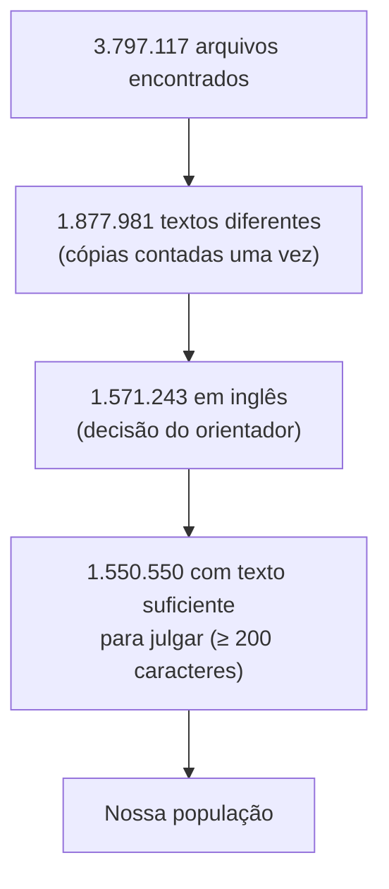
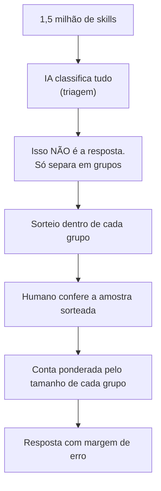
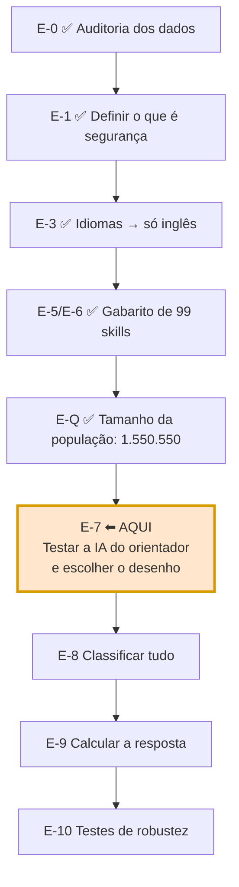

Este documento conta **tudo o que foi feito até agora**, em linguagem simples.
Serve para retomar o projeto depois de um tempo ou para explicá-lo a alguém de
fora.

> Este é o resumo **narrativo**. O panorama técnico está em
> [[00 - Research Overview]], o plano por etapas em [[03 - Methodology]] e
> todas as decisões, com data e motivo, no [[Decision Log]].

---

## 1. Em um parágrafo

Estudamos **agent skills**: arquivos de texto que dizem a um agente de IA (como
o Claude Code) como fazer alguma coisa. Existem quase **1,9 milhão** desses
arquivos públicos no GitHub. A pergunta é simples de enunciar e difícil de
responder direito: **quantos deles são sobre segurança?**

> **Onde estamos (13/09).** Temos o **gabarito**: 99 skills sorteadas,
> classificadas por dois modelos de IA e, onde eles discordaram, por dois
> pesquisadores. Temos também o **tamanho exato da população** que a pesquisa
> cobre: 1.550.550 skills. Um **primeiro número** saiu desse gabarito, cerca de
> 56% de skills com alguma consideração de segurança, mas **ainda não é a
> resposta** (seção 10). O próximo passo é testar o modelo de IA que vai rodar
> na máquina do orientador.

---

## 2. O que é uma "agent skill"

Uma pasta com um arquivo `SKILL.md`. O arquivo tem instruções em linguagem
natural, e o agente lê a descrição e **decide sozinho** quando usar a skill.

O que torna isso interessante para pesquisa:

- é **texto**, não código: nenhum compilador verifica;
- é escolhido **na hora**, pela IA, e não pelo programador;
- se espalha **copiando e colando**, sem gerenciador de pacotes;
- ninguém assina, ninguém revisa, não existe registro central.

Ou seja: é software que roda sem nenhuma das travas que o software normal tem.

---

## 3. Os dados, e quem entra na pesquisa

Usamos o **GitSkills**, um dataset publicado em julho de 2026. Nem todo arquivo
entra na conta: aplicamos três filtros, **nesta ordem**.



A ordem importa. Se cada filtro fosse medido sozinho e os números fossem
somados, a exclusão sairia inflada: **4.591** arquivos são ao mesmo tempo
não-ingleses e curtos demais, e seriam descontados duas vezes.

**Nem todo `SKILL.md` é uma skill.** Olhando a amostra, achamos arquivos que
eram **saída** de algum processo salva com esse nome: um despejo de resultados
de pesquisa no Reddit, um documento de contexto gerado por outra ferramenta.
Eles ficam **marcados**, não removidos, porque ainda não sabemos quantos existem
na população (seção 13).

---

## 4. A pergunta central

> **Qual a porcentagem de agent skills públicas que são skills de segurança?**

Duas dificuldades: **o que conta como "de segurança"?** e **ninguém consegue
ler 1,5 milhão de arquivos**.

---

## 5. O que conta como segurança: três classes

Decidimos pensar em cada skill como um **profissional**:

| Classe | Se a skill fosse uma pessoa… | Exemplo |
|---|---|---|
| `PRIMARY` | seria um **profissional de segurança** | scanner de vulnerabilidade |
| `SECONDARY` | seria um profissional **de outra área** cujo trabalho **encosta** em segurança | skill de deploy que manda não subir as chaves; agente limitado a ler, sem poder escrever |
| `NONE` | nada no trabalho dela envolve segurança | formatador de código |

**Skill de segurança = `PRIMARY` + `SECONDARY`**, sempre reportadas também
separadas.

O `SECONDARY` é **largo de propósito**: basta a consideração de segurança
**estar lá**, mesmo pouca. Depois vamos subdividir esse grupo olhando as
justificativas, e é mais fácil recortar um grupo grande do que recuperar o que
foi descartado cedo demais.

> Até 03/09 eram cinco classes, com `MENTION` (só cita de passagem) e
> `AMBIGUOUS` (não dá para saber). Os testes mostraram que a fronteira entre
> "cita" e "faz" era justamente onde os classificadores mais discordavam, e as
> duas classes saíram. O que não dá para julgar agora sai da **população**, em
> vez de virar uma classe.

---

## 6. Como vamos responder

O jeito ingênuo seria pedir para uma IA classificar tudo e contar. **Isso não
funciona**, e não é opinião: Egami et al. (NeurIPS 2023) mostraram que usar
rótulo de IA direto como resposta produz **viés grande e margem de erro
inválida, mesmo quando a IA acerta 80–90%**.

O desenho que adotamos (o **Desenho C**):



A ideia central: **a IA só organiza a fila; quem dá a nota final é o humano.**
Se a IA errar, o resultado continua correto, só fica menos preciso.

**Três números que nunca podem ser confundidos:**

| Número | É a resposta? |
|---|---|
| Quantas a IA achou que eram de segurança | **não** |
| Quantas apareceram na amostra conferida | **não**, é só da amostra |
| A conta ponderada final | **sim** |

> **Um detalhe que mudou a conta.** Esse desenho foi pensado supondo que skills
> de segurança fossem **raras** (uns 5%). O gabarito sugere que, com o
> `SECONDARY` largo, elas são perto de **metade**. Quando o grupo não é raro,
> sortear direto na população pode sair tão barato quanto separar em grupos.
> Qual caminho seguir é uma decisão do orientador na próxima etapa (seção 14).

---

## 7. O caminho completo



---

## 8. O que já foi feito

| Experimento | O que fez | Resultado principal |
|---|---|---|
| **EXP-001** | Conferiu os dados | Estrutura íntegra. **Achou um erro grave no trabalho anterior** (seção 12) |
| **EXP-002** | Testou busca por palavra-chave | Não filtra nada: **78,69%** citam algum termo de segurança |
| **EXP-003/004** | Mediu os idiomas | **~14% não é inglês**. Depois, a pesquisa foi restrita ao inglês |
| **EXP-005 / EXP-012** | Primeira volta de teste, de ponta a ponta | Provou que o processo funciona; o número dela (1,61%) **não vale** (seção 11) |
| **EXP-013** | Sorteou 100 skills e testou três IAs | Concordância fraca: o problema estava nas **classes**, não nas IAs |
| **EXP-014** | Refez com três classes; humanos decidiram as discordâncias | Concordância subiu para **substancial**; **gabarito de 99** |
| **EXP-015** | Procurou arquivos que não são skills | Existem; a busca automática acha só uma fração |
| **EXP-016** | Aplicou os filtros em ordem | **1.550.550** skills na população |

---

## 9. Como montamos o gabarito

**Passo 1: duas IAs, sem ver uma à outra.** GPT e Claude classificaram as
mesmas 100 skills. Havia uma terceira (Gemini), mas a cota dela acabou antes do
fim.

**Passo 2: medir se elas concordam.** Com cinco classes, não concordavam. Com as
três classes da seção 5, a concordância na pergunta que importa ("é de segurança
ou não?") subiu de κ = 0,540 para **κ = 0,672**, uma concordância
**substancial**. Onde as duas concordaram (84 skills), aceitamos o rótulo.

**Passo 3: onde discordaram, dois pesquisadores decidiram.** Foram 16 skills.
Victor e Havillon classificaram cada uma **sozinhos, sem conversar**, cada um no
seu arquivo. Depois compararam:

- concordaram de primeira em **10 das 16**;
- em **2**, um erro de marcação (o rótulo dizia uma coisa e a própria
  justificativa dizia outra), corrigido e registrado;
- as **4 restantes** foram decididas **em conjunto**, relendo cada caso. As
  quatro ficaram como `NONE`, com o motivo escrito caso a caso.

A pergunta que resolveu a maioria das discussões: **aquela regra ou verificação
existe para proteger alguma coisa, ou só para o trabalho sair certo?** Rodar um
linter é qualidade; proibir o agente de usar certas ferramentas é proteção.

Os dois arquivos individuais continuam guardados, sem alteração de julgamento.
É deles que sai a medida de quanto os pesquisadores concordam, e ela é
reportada **antes** da conversa.

**Resultado:** 99 skills (uma saiu por ter só 75 caracteres), sendo
**9 `PRIMARY` · 46 `SECONDARY` · 44 `NONE`**.

> **O ponto fraco declarado.** As 83 skills em que as duas IAs concordaram
> **nunca foram lidas por um humano**. Se as duas IAs errarem do mesmo jeito,
> ninguém vê. Isso foi aceito na decisão do desenho (D-026) e vai escrito no
> trabalho.

---

## 10. O primeiro número, e o que ele NÃO é

Tratando o gabarito como uma amostra sorteada da população:

> **~56% das skills têm alguma consideração de segurança**
> (margem de erro: entre **46% e 66%**).
> **~9%** têm segurança como objetivo principal (`PRIMARY`).

**Isso ainda não é a resposta da pesquisa**, por três motivos:

1. **São só 99 skills**, então a margem é de uns 10 pontos para cada lado.
2. **83 rótulos vieram só das IAs**, sem conferência humana.
3. O `SECONDARY` é **largo de propósito** (seção 5). "56%" quer dizer "tem
   alguma consideração de segurança", não "é uma ferramenta de segurança".

O `PRIMARY` de ~9% bate com outro estudo publicado (*Agent Skills in the Wild*,
7,3%), o que é um bom sinal de que a classe está bem definida.

**Números que definitivamente não são a resposta:**

| Número | O que significa mesmo |
|---|---|
| **52,93%** | citam alguma palavra de segurança (inclui `token`, quase sempre de IA) |
| **78,69%** | caíram numa busca ampla por palavra |
| **1,61%** | saiu do classificador de teste (seção 11), que nem reconhecia `SECONDARY` |

---

## 11. A primeira volta de teste (agosto)

Antes do desenho atual, fizemos uma volta completa **só para provar que o
processo funciona**: 50 skills preenchidas com ajuda de IA, três classificadores
automáticos comparados, o escolhido rodado nos 1,9 milhão.

O achado mais importante: os classificadores simples **nunca** reconheceram a
classe do meio (`SECONDARY`), exatamente a que decide o resultado. O número que
saiu, **1,61%**, é portanto um piso inválido. Serviu de lição: é mais um motivo
para não "rodar uma IA barata e contar".

---

## 12. Os erros que encontramos em nós mesmos

Registrar os próprios erros **é** o método. Cada um está no [[Decision Log]] com
data, causa e correção.

- **O número original estava errado.** O notebook inicial dizia *"1,1% das
  skills mencionam segurança"*, mas tinha pegado as 5.000 **primeiras linhas**
  do arquivo achando que era sorteio. Refeito direito: **52,93%**.
- **O teste do detector de idioma estava mal montado**, e escrevemos
  "concordância 1,00" para chinês **sem ter medido**. Refeito: 0,987.
- **O formulário de anotação vazava a resposta**: mostrava a nota prévia do
  computador antes do texto. Agora é **cego**.
- **Um plugin de memória vazou informação** entre as sessões das IAs: uma delas
  começou sabendo o viés da outra. Não dava para desfazer; está declarado como
  limitação.
- **Um filtro quase deu impressão falsa de limpeza.** A busca automática por
  "arquivos que não são skills" achava só 707, contra dezenas de milhares
  estimados. Usá-la faria a população *parecer* limpa sem estar. Preferimos
  marcar e medir depois.
- **Uma referência bibliográfica quase foi fabricada**: a busca por título
  devolveu um artigo de economia com nome parecido. Hoje toda referência é
  conferida pelo DOI.

---

## 13. O que falta decidir

| Decisão | Por que importa |
|---|---|
| **Qual desenho seguir** (grupos, sorteio simples maior ou dois estágios) | Com prevalência perto de 50%, a vantagem de separar em grupos precisa ser recalculada |
| **O que é "bom o bastante"** para a IA do orientador | Precisa ser decidido **antes** de ver o resultado, senão qualquer resultado vira "bom" |
| **Quantos arquivos não são skills** | Hoje estão marcados, não removidos. Falta ler uma amostra do grupo onde eles se escondem (~206 mil arquivos) |
| **Conferir parte das 83 skills só das IAs?** | É o ponto fraco declarado do gabarito |

---

## 14. Próximo passo

**Testar o modelo de IA que roda na máquina do orientador**, contra o gabarito
de 99 skills. Em ordem:

1. **Guardar o gabarito** no Git antes de a IA nova vê-lo, para ninguém ajustar
   o teste olhando a resposta.
2. Saber do orientador **qual modelo é e quanto a máquina aguenta**.
3. Rodar nas 99 e medir **quanto tempo leva**, para saber se dá para rodar em
   1,5 milhão.
4. Medir **quanto ela acerta**, separando as 83 skills que vieram das IAs e as
   16 decididas por humanos, que são as difíceis.
5. Com esses números, o orientador escolhe o desenho (seção 13).

Plano detalhado: [[03 - Methodology]], etapa E-7.

---

## 15. Onde está cada coisa

```
notes/
  Resumo do Trabalho          este arquivo
  03 - Methodology            o plano por etapas
  Decisions/
    Decision Log              TODAS as decisões (D-001 a D-031), com data e motivo
    Codebook                  as regras de classificação (v2.6)
  Instruments/                prompt das IAs, guia do anotador humano
  Methodology/                desenho estatístico da QI-1
  Experiments/                EXP-013 a EXP-016 (os anteriores em _arquivo/)
  Literature/                 as referências, uma nota por artigo

scripts/    os programas que geram tudo
results/    os números — comece pelo README.md de lá
  EXP-014_gold_set.csv        o gabarito de 99 skills
referencias.bib               bibliografia conferida
```

---

## 16. Duas regras que valem para tudo

**1. IA não é gabarito.** Ela ajuda a organizar, sugere e pré-classifica. O que
vira resultado passa por julgamento humano, ou fica declarado como limitação
quando não passa.

**2. Todo número precisa de um script.** Se um número aparece no texto e não dá
para apontar o programa que o gerou e o arquivo onde ele foi salvo, ele sai do
texto.

## Ligações

[[00 - Research Overview]] · [[01 - Research Question]] · [[03 - Methodology]] ·
[[Decision Log]] · [[Codebook]] · [[QI-1 Methodology]] · [[Guia do Anotador Humano]] ·
[[EXP-013]] · [[EXP-014]] · [[EXP-015]] · [[EXP-016]]
