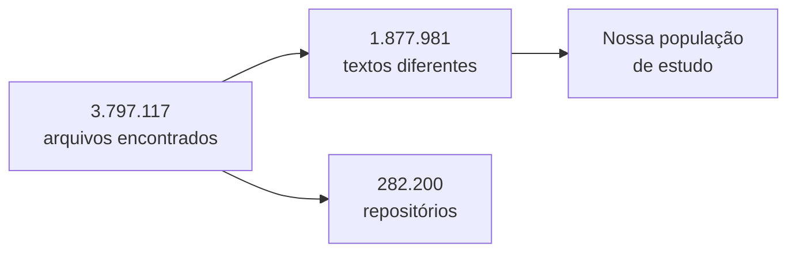
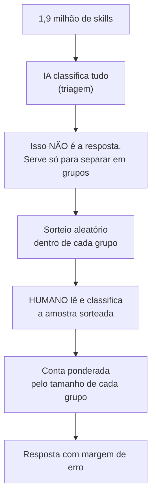
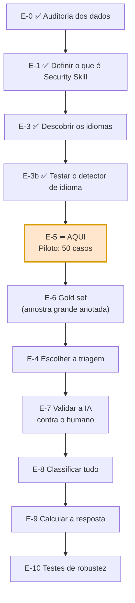
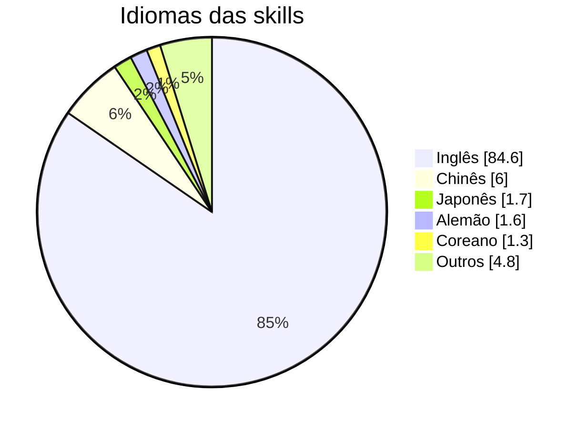

Este documento conta **tudo o que foi feito até agora**.
Serve para retomar o projeto depois de um tempo, ou para explicar a alguém de fora.

> Este é o resumo **narrativo**. O panorama técnico está em
> [[00 - Research Overview]], e o plano detalhado em [[03 - Methodology]].

---

## 1. Em um parágrafo

Estamos estudando **agent skills** — arquivos de texto que dizem a um agente de IA
(como o Claude Code) como fazer alguma coisa. Existem quase **1,9 milhão** desses
arquivos públicos no GitHub. Queremos responder uma pergunta simples de enunciar e
difícil de responder direito: **quantos deles são sobre segurança?**

Até agora **não temos essa resposta** — e isso é proposital. O que construímos foi o
método para chegar nela de um jeito que se sustente numa banca.

> **Atualização (23/08).** Fizemos uma primeira volta completa do processo, de
> ponta a ponta, como prova de conceito: anotamos 50 casos (com ajuda de IA),
> treinamos um classificador, comparamos três jeitos de fazer isso, escolhemos
> um e rodamos ele nos 1,9 milhão de skills. O número que saiu (**1,61%** de
> segurança) **não é a resposta da pesquisa** — é só a prova de que a máquina
> inteira funciona. Detalhe na seção 17.

---

## 2. O que é uma "agent skill"

Uma pasta com um arquivo `SKILL.md` dentro. O arquivo tem instruções em linguagem
natural. O agente lê a descrição e **decide sozinho** quando usar aquela skill.

O que torna isso interessante para pesquisa:

- é **texto**, não código — nenhum compilador verifica;
- é escolhido **na hora**, pela IA, não pelo programador;
- se espalha **copiando e colando** — não existe gerenciador de pacotes;
- ninguém assina, ninguém revisa, não existe registro central.

Ou seja: é software que roda sem nenhuma das travas que o software normal tem.

---

## 3. Os dados

Usamos o **GitSkills**, um dataset publicado por pesquisadores em julho de 2026.



A diferença entre 3,8 milhões e 1,9 milhão é simples: **muita gente copia a mesma
skill**. Contamos cada texto uma vez só.

---

## 4. A pergunta central

> **Qual a porcentagem de agent skills públicas que são skills de segurança?**

Parece direto. Não é. Duas dificuldades:

**Primeira: o que conta como "de segurança"?** Uma skill que diz *"não deixe sua
senha no código"* é de segurança? E uma de revisão de código que tem um capítulo
sobre falhas de segurança?

**Segunda: ninguém consegue ler 1,9 milhão de arquivos.**

---

## 5. O que decidimos que conta

Quatro classes, mais uma quinta para os casos sem resposta:

| Classe | Significado | Exemplo |
|---|---|---|
| `PRIMARY` | segurança **é** o objetivo | scanner de vulnerabilidade |
| `SECONDARY` | segurança é parte importante do trabalho | skill de revisão de código com seção de segurança |
| `MENTION` | só cita de passagem | *"guarde as chaves em local seguro"* |
| `NONE` | não tem nada a ver | formatador de código |
| `AMBIGUOUS` | não dá para saber | texto genérico demais |

**Security Skill = `PRIMARY` + `SECONDARY`.**

A regra prática que separa `SECONDARY` de `MENTION`: o texto diz **o que fazer**
(um procedimento, uma lista, o que procurar) ou só **o que evitar** (um aviso)?
Procedimento é `SECONDARY`. Aviso é `MENTION`.

> **Isso importa muito.** A skill mais comum entre as que falam de segurança é
> `code-review` — revisão de código genérica com um capítulo de segurança. Ela é
> `SECONDARY`. Por isso vamos **sempre reportar `PRIMARY` e `SECONDARY` separados**:
> se juntar tudo, o número fica dominado por revisão de código.

---

## 6. Como vamos responder

O jeito ingênuo seria: pedir para uma IA classificar tudo e contar. **Isso não
funciona** — e não é opinião, é resultado publicado. Egami et al. (NeurIPS 2023)
mostraram que usar rótulo de IA direto como resposta produz **viés grande e
intervalo de confiança inválido, mesmo quando a IA acerta 80–90%**.

Nosso desenho (chamado **Desenho C**):



A ideia central: **a IA só organiza a fila; quem dá a nota é o humano.** Se a IA
errar, o resultado continua correto — só fica menos preciso, exigindo uma amostra
maior. O erro da IA custa **eficiência**, não **validade**.

A fórmula final pesa cada grupo pelo tamanho que ele tem na população:

$$\hat{p} = \sum_h \frac{N_h}{N}\,\hat{p}_h$$

Em português: *"a porcentagem de cada grupo, multiplicada pelo peso daquele grupo,
tudo somado"*.

### Três números que nunca podem ser confundidos

| Número | É a resposta? |
|---|---|
| Quantas a IA achou que eram de segurança | **não** |
| Quantas o humano achou na amostra | **não** (é só da amostra) |
| A conta ponderada final | **sim** |

---

## 7. O caminho completo



**Estamos em E-5, mas com uma volta de teste já dada por fora deste caminho.**
Os 50 casos do piloto foram preenchidos — com ajuda de IA, não por um humano do
zero, então isso **não conta como o E-5 "de verdade"** ainda. Em paralelo,
usamos esse preenchimento como um **ensaio geral (v1)**: treinamos um
classificador nele e rodamos nos 1,9 milhão de skills, só para provar que o
cano inteiro (anotar → treinar → validar → classificar tudo) funciona de
ponta a ponta. Ver seção 17.

---

## 8. O que já foi feito

| Experimento | O que fez | Resultado principal |
|---|---|---|
| **EXP-001** | Conferiu os dados | Estrutura íntegra. **Achou um erro grave no trabalho anterior** |
| **EXP-002** | Testou busca por palavra-chave | Não filtra nada: **78,69%** das skills citam algum termo de segurança |
| **EXP-003** | Mediu os idiomas | **~14% não é em inglês** (~267 mil skills) |
| **EXP-004** | Testou o detector de idioma | Dois detectores concordam em **98,7%** dos casos |
| **EXP-005** | Montou e (com ajuda de IA) preencheu a amostra do piloto | **50 casos** anotados — golden set v1, ainda não é gold standard humano |
| **EXP-012** | Treinou 3 classificadores, escolheu 1, classificou tudo | **1,61%** de segurança — número **preliminar**, não é a resposta |

### O erro que encontramos no começo

O notebook original dizia: *"1,1% das skills mencionam segurança"*.

Esse número estava errado. Ele pegou as 5.000 **primeiras linhas** do arquivo achando
que era uma amostra aleatória. Não era — as primeiras linhas são um bloco específico,
e a maior parte nem tinha o texto da skill (tinha um caminho de atalho de sistema,
com 42 caracteres).

Refeito do jeito certo, com as mesmas palavras-chave: **52,93%**. Quarenta e oito
vezes maior.

O notebook ficou marcado como legado e nenhum número dele é usado.

---

## 9. Os números que temos — e o que eles NÃO são

> **Nenhum destes é a resposta da pesquisa.**

| Número | O que significa mesmo |
|---|---|
| **52,93%** | citam alguma palavra-chave de segurança. Inclui `token` (que quase sempre é token de IA, não de senha) |
| **78,69%** | caíram na busca ampla. Mostra que buscar por palavra **não filtra** |
| **~14%** | não é escrito em inglês |
| **11,4%** | trazem scripts executáveis junto |

O primeiro é o mais perigoso: parece uma resposta e não é. Ele mede **vocabulário**,
não **propósito**.

---

## 10. Sobre os idiomas

Descobrimos que **uma em cada sete skills não é em inglês**. O chinês sozinho são
~112 mil skills.



Decidimos que **nenhuma skill sai da pesquisa por causa do idioma**. Isso é mais
rigoroso que a prática comum da área — os trabalhos parecidos que encontramos ou
excluem o não inglês, ou simplesmente não falam do assunto.

Consequências práticas:
- a amostra do piloto é **metade não inglesa**, de propósito;
- vamos medir o desempenho **por idioma**, não só no total;
- tradução só como apoio, **nunca substituindo o texto original**.

---

## 11. Os erros que encontramos em nós mesmos

Uma auditoria adversarial revisou tudo procurando problemas. Achou seis coisas
graves. Duas eram bugs no nosso próprio código:

**O detector de idioma foi mal testado.** Nosso teste separava os casos por *tipo de
escrita* antes de separar por *idioma*. Como quase todo texto em chinês tem alguma
palavra em inglês no meio, o chinês inteiro caiu no grupo errado — sobraram **10
casos de 6.000**. E nós escrevemos "concordância 1,00" para chinês e japonês **sem
ter medido de verdade**. Refizemos: agora está medido, e o resultado é bom (0,987).

**O formulário de anotação vazava a resposta.** Ele mostrava, antes do texto da
skill, a "nota prévia" que o computador tinha dado e até a frase *"selecionado por:
dirigido fronteira SECONDARY/MENTION"*. Quem fosse anotar já começaria influenciado.
Agora o formulário é **cego** — só nome, descrição e texto. As informações de grupo
ficam num arquivo separado, que só se abre **depois** de terminar a anotação.

Outros quatro: o `mixed` (texto misturado) estava marcando qualquer palavra em
inglês; o codebook ainda tinha exemplos que mandavam usar `AMBIGUOUS` por causa de
idioma — o que uma decisão anterior *dizia* ter corrigido; a fórmula do `AMBIGUOUS`
não funcionava com amostragem por grupos; e a população ainda inclui arquivos que
provavelmente nem são skills.

> Registrar os próprios erros **é** o método. Cada um está documentado com data,
> causa e correção no [[Decision Log]].

---

## 12. O piloto que está pronto (e já foi preenchido, com ressalva)

**50 casos**, sorteados com semente fixa. Rodamos duas vezes e deu **exatamente o
mesmo resultado** — qualquer pessoa reproduz.

> **Os 50 casos já foram preenchidos** — mas com ajuda de IA, não por um humano
> lendo do zero. Por isso viramos ele em "golden set operacional v1": serve
> para testar o cano inteiro (seção 17), mas **não substitui** a anotação
> humana de verdade que o E-5 pede, nem o gold set maior do E-6.

A amostra foi montada de propósito para ser **difícil**, não representativa:

- 25 em inglês, 25 em outros idiomas (10 idiomas no total);
- 11 casos de governança/conformidade (a fronteira mais discutível);
- 12 com idiomas misturados;
- 7 de revisão de código;
- 3 escolhidos justamente na fronteira `SECONDARY` × `MENTION`.

O objetivo **não** é medir prevalência. É descobrir:
- as regras funcionam na prática?
- quanto tempo leva cada anotação?
- leva mais tempo em outro idioma?
- onde o codebook ainda é ambíguo?

---

## 13. O que falta decidir (precisa de humano)

| Decisão | Por que trava |
|---|---|
| **Elegibilidade** | O conjunto ainda tem arquivos de 42 caracteres que provavelmente não são skills. Isso muda o denominador da conta final |
| **Classificar tudo ou só uma parte?** | Depende do custo real, que só o piloto vai revelar |
| **Unidade de análise** | Está usada em tudo mas nunca foi formalmente aceita |
| **Segundo anotador** | Sem ele, vira uma limitação declarada. IA **não pode** fazer esse papel |
| **Refazer o piloto com humano de verdade?** | O golden set v1 (seção 17) foi anotado com ajuda de IA. Falta decidir se isso basta para seguir para o E-6, ou se vale a pena refazer o E-5 só com humano antes |

---

## 14. Como retomar o trabalho

```bash
# 1. ler o pacote de leitura (cego, sem as dicas do computador)
results/EXP-005_reading_pack.md

# 2. preencher o formulário
results/EXP-005_annotation_form.csv

# como preencher: exemplo com 7 casos resolvidos
results/EXP-005_annotation_example.csv

# 3. NÃO abrir antes de terminar:
results/EXP-005_strata_key.csv
```

Se precisar gerar a amostra de novo:

```bash
uv run --with duckdb --with py3langid --with lingua-language-detector \
  python scripts/build_pilot_sample.py
```

---

## 15. Onde está cada coisa

```
notes/
  00 - Research Overview      panorama técnico
  01 - Research Question      as perguntas
  03 - Methodology            o plano por etapas
  Decisions/
    Decision Log              TODAS as decisões, com data e motivo
    Codebook                  as regras de classificação (v2.3)
  Methodology/
    QI-1 Methodology          o desenho estatístico
    Multilingual Strategy     como lidar com idiomas
  Literature/
    Multilingual Methodology Review    os artigos que embasam o método
  Experiments/                EXP-001 a EXP-005, EXP-012
  Meetings/                   pauta para o orientador (fora do Git)

scripts/    os programas que geram tudo
results/    os números e as amostras
models/     os classificadores treinados (não fica no Git, dá pra refazer)
```

---

## 16. O ensaio geral: treinamos um classificador e rodamos em tudo (v1, não é o resultado)

Depois de ter os 50 casos preenchidos, decidimos não esperar o gold set "de
verdade" (E-6) para testar se o resto do processo funciona. Chamamos isso de
**iteração v1** — uma prova de conceito, guardada à parte do caminho oficial.

**O que fizemos, em ordem:**

1. Congelamos os 50 casos num commit do Git — ponto de partida fixo, para
   nunca misturar "antes" e "depois" do treino.
2. Separamos as respostas de cada caso do texto de cada skill, com cuidado
   para **não deixar vazar** nenhuma pista de como aquele caso foi escolhido
   para a amostra (isso inflaria artificialmente o resultado).
3. Testamos **três jeitos diferentes** de fazer um computador reconhecer
   segurança num texto: dois mais simples e baratos (contagem de pedaços de
   palavra) e um mais sofisticado (um modelo de linguagem multilíngue menor).
4. Comparamos os três de forma justa (repetindo o teste várias vezes, sempre
   escondendo uma parte dos 50 casos do treino para conferir se ele acerta o
   que nunca viu).

**O que descobrimos — e é o achado mais importante desta etapa:** os dois
jeitos simples e baratos **nunca** conseguiram reconhecer a classe
`SECONDARY` nem `MENTION` — exatamente a fronteira que decide o resultado da
pesquisa inteira (seção 5). O jeito sofisticado reconheceu bem melhor, mas é
**lento demais** para rodar nos 1,9 milhão de skills nesta máquina (sem uma
placa de vídeo boa, levaria quase um dia inteiro rodando sem parar).

**A escolha que fizemos:** para não travar a prova de conceito, usamos o
jeito rápido (mas fraco) para classificar tudo, deixando bem marcado que o
resultado é **fraco e preliminar**. Isso é uma decisão registrada, com os
dois lados explicados, no [[Decision Log]] (D-023) — não escondemos a
fraqueza do modelo escolhido.

**O número que saiu:** classificamos os 1.877.981 textos e **1,61%** vieram
como "de segurança" (`PRIMARY`+`SECONDARY`). **Isso não é a resposta da
pesquisa.** É só a prova de que a esteira inteira — anotar, treinar, testar,
rodar em tudo — funciona sem travar.

> [!warning] Uma trombada no caminho, também registrada
> A primeira tentativa de rodar nos 1,9 milhão de textos foi cronometrada
> errado — achamos que levaria 15 minutos, e na real levaria quase 9 horas.
> O motivo: um teste rápido, sem querer, mediu em textos muito curtos (o
> mesmo tipo de erro de amostragem que já tinha estragado o resultado do
> notebook original, seção 8). Depois de medir direito e otimizar (sem
> mudar o modelo, só deixando ele ler menos texto e não repetir trabalho à
> toa), o processo real levou **70 minutos**. Detalhe completo também no
> [[Decision Log]] (D-023).

**Por que isso importa para o resto da pesquisa:** confirma, com dado e não
só teoria, por que não dá para simplesmente "rodar uma IA em tudo e contar" —
o jeito rápido nem reconhece a classe que mais importa. Reforça que o
gold set (E-6) precisa ser grande o bastante, e com bastante casos bem na
fronteira `SECONDARY`/`MENTION`, para que o classificador definitivo (E-7)
tenha chance real de aprender essa distinção.

---

## 17. Duas regras que valem para tudo

**1. IA não é gabarito.** Ela ajuda a organizar, sugere, pré-classifica. Mas o que
vira resultado passa por julgamento humano. Isso está registrado como decisão formal
e vale sem exceção.

**2. Todo número precisa de um script.** Se um número aparece no texto e não dá para
apontar o programa que o gerou e o arquivo onde ele foi salvo, ele sai do texto.
Já removemos números que não passaram nesse teste.

## Ligações

[[00 - Research Overview]] · [[01 - Research Question]] · [[03 - Methodology]] ·
[[Decision Log]] · [[Codebook]] · [[QI-1 Methodology]] · [[Multilingual Strategy]] ·
[[Multilingual Methodology Review]] · [[EXP-001]] · [[EXP-002]] · [[EXP-003]] ·
[[EXP-004]] · [[EXP-005]] · [[EXP-012]]
